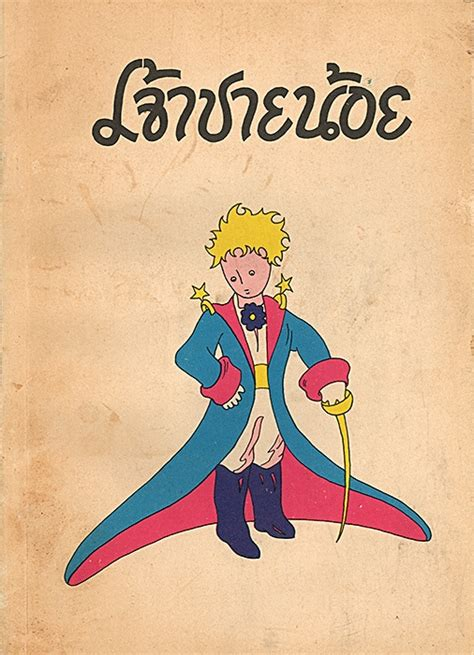
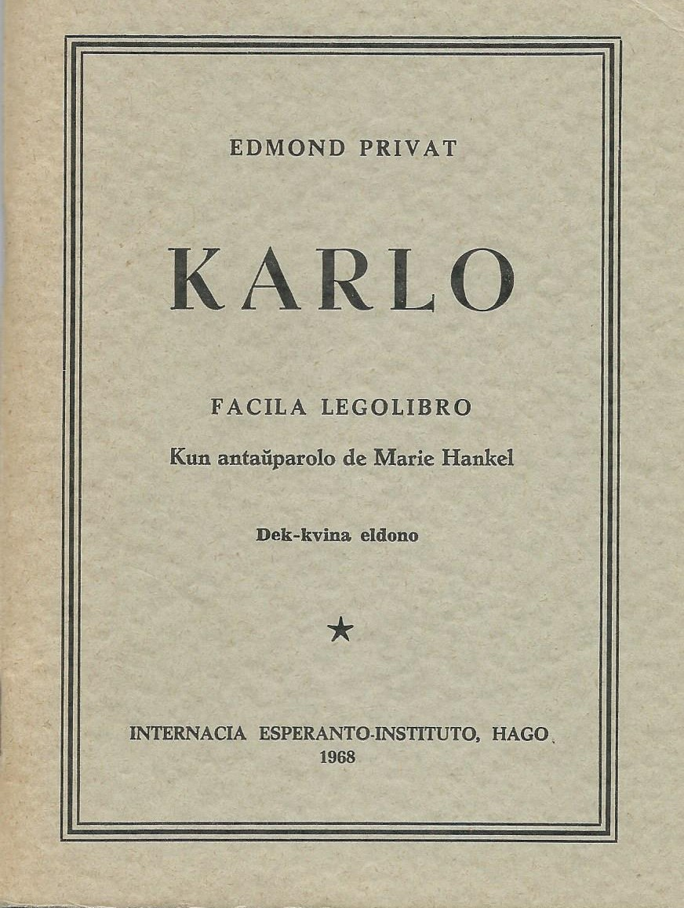
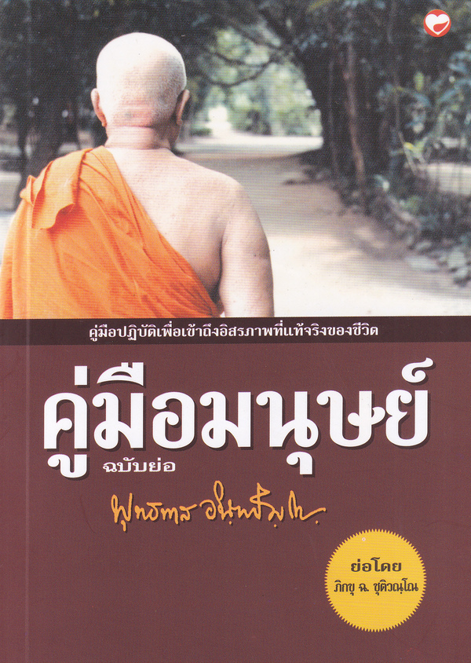
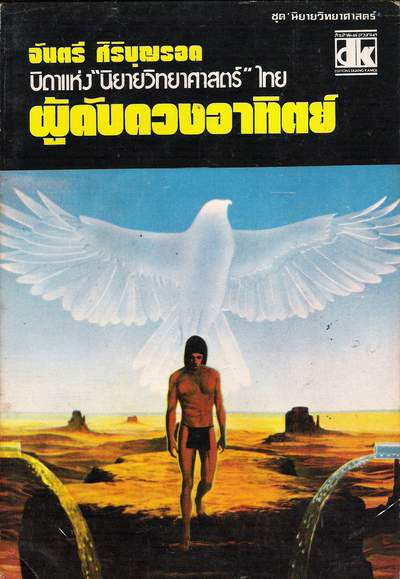
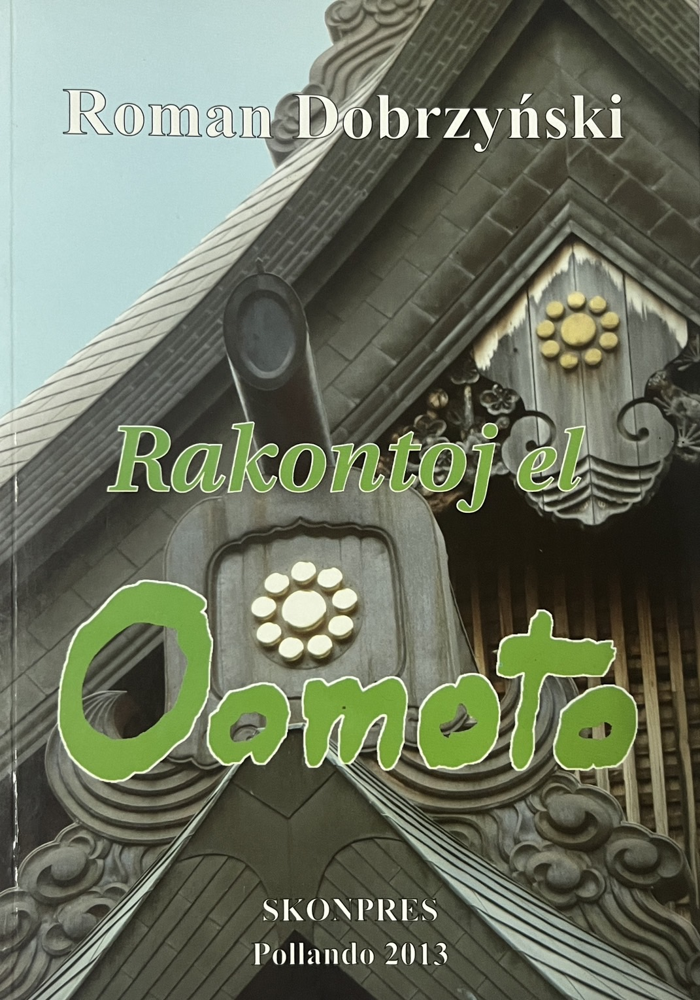
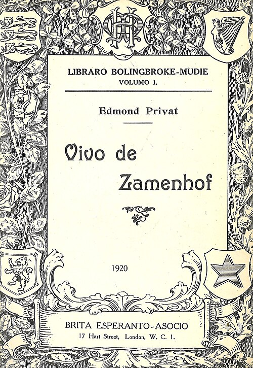
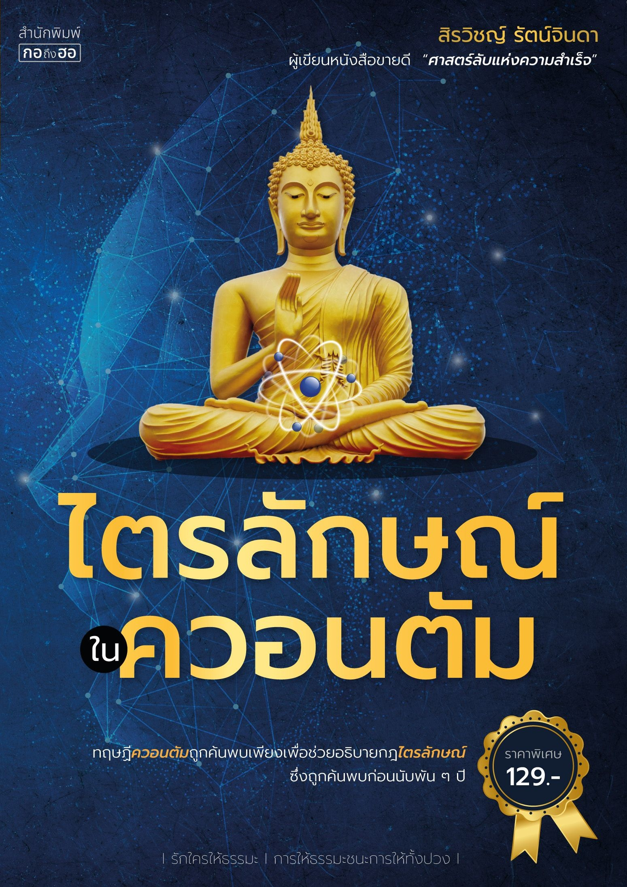

หนังสือที่ผมอ่าน
DATE: 2024-12-01

Mi estas kolektanto de libroj, en mia hejmo multas la libroj, pri muziko, lingvoj, vortaroj en diversaj lingvoj, kaj Esperanto, tamen mi nur legis partojn de ili. Jen estas korviloj de libroj, kiujn mi finligis. Kaj mi opinias, ke ili estas interesaj, ili estas nur kelkaj, ĉar mi ne momoras, kiujn librojn mi finlegis antaŭe. Kiam mi havas emon kaj tempon, mi aldonos pli da finlegitaj libroj kaj ankaŭ la kritikojn al ĉiu libro. 

จริง ๆ แล้วผมเป็นคนชอบหนังสือ ซื้อจนเต็มบ้านไปหมด แต่ไม่ต้องตกใจนะที่ว่าเต็มบ้านก็ 4 ลัง กับ 1 ตู้ เป็นหนังสือเรียนสมัยเด็กบ้าง หนังสือดนตรีไทยบ้าง(อันนี้มีเยอะ) หนังสือภาษาต่าง ๆ โดยเฉพาะหนังสือภาษาเอสเปรันโตอันนี้มีหลายสิบเล่ม นอกจากนี้ยังมีพจนานุกรมภาษาต่าง ๆ แต่ว่าจริง ๆ ก็อ่านไม่จบหรอก ชอบอ่านเร็ว ๆ มากกว่า หรือไม่ก็อ่านเฉพาะส่วนที่ชอบ จริง ๆ หนังสือที่อ่านจบก็มีมากแต่จำไม่ได้ (บอกตรง ๆ ว่าพักนี้จำอะไรไม่ค่อยได้ดีสักเท่าไหร่) เอาเป็นว่ามาเริ่มกันใหม่ ผมเชื่อเสมอว่าทุกอย่างเริ่มต้นใหม่ได้เสมอ ต่อไปนี้จะเป็นรายชื่อหนังสือที่ผมอ่านจนจบ ตั้งแต่ ม.4 จนถึงปัจจุบัน:
 

  
  
  
  
  
  
  
  

2025-12-10 22:58

[ย้อนหลัง], [หนังสือที่อ่าน]