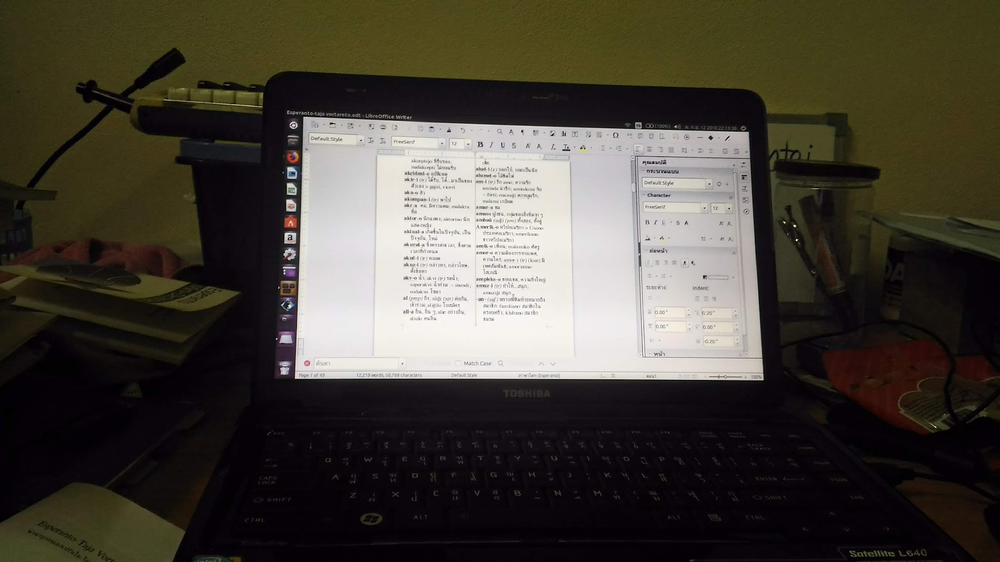
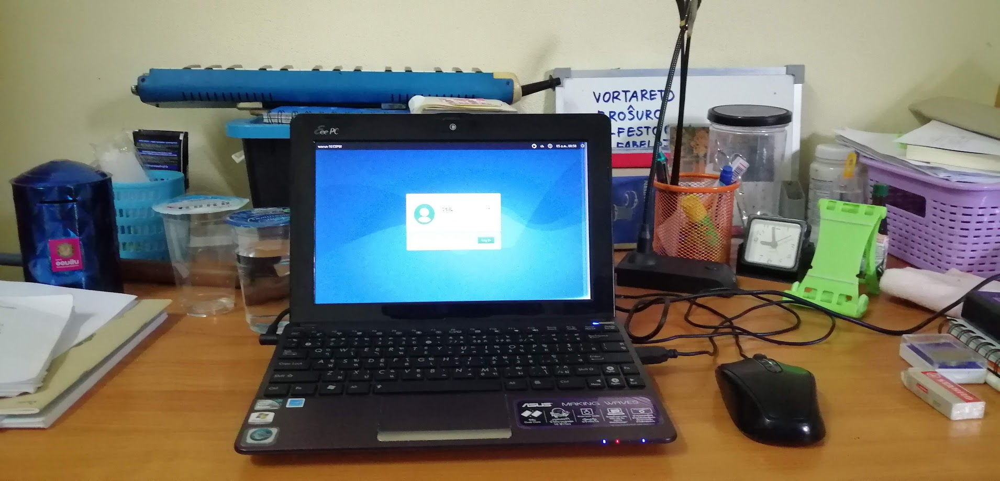
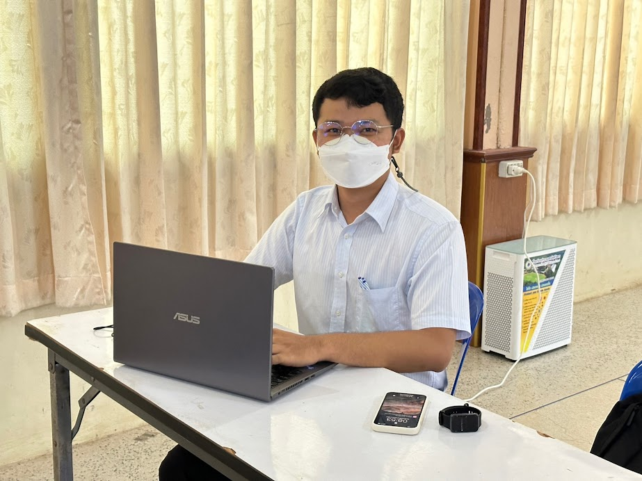
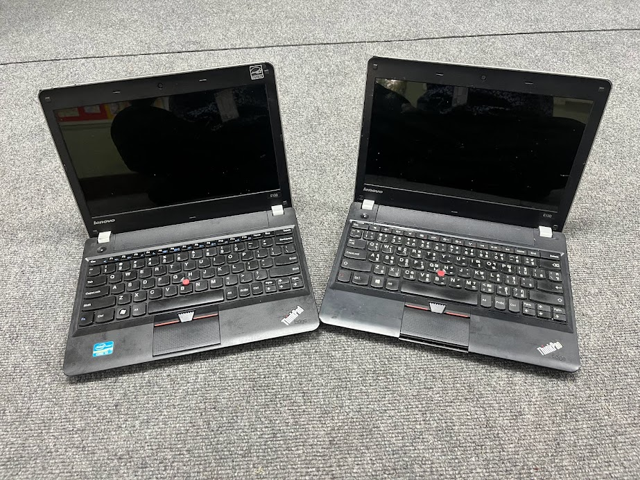

<link rel="stylesheet" href="stilo.css">  

# 💻Komputilo

Jen estas paĝo pri komputeraj aferoj de mi.

## Mia komputilo

- Mia unua komputilo estis persona komputilo aĉetita de mia pli aĝa fratino (ĉ. 2009-2010). Nun mi ne plu povas memori, kia cxefprocesoro estis. Kaj eble la operaciumo estis Windows Vista. Nuntempe ĝi ne plu aktivas. Mi jam forvendis ĝin. Mi nun ne povas retrovi la foton de ĝi.
- Temas pri mia nuna persona komputilo, kiu nun estas en la hejmo. Mi aĉetis malmultekostan komputilon, kaj mi en ĝin instalis la operaciumon Xubuntu.

> mi nun serĉas foton de mia komputilo, se mi trovis ĝin mi aperigos ĝin ĉi tie

## Miaj tekokomputiloj

### La 1-a tekokomputilo
Temas pri mia unua tekokpmputilo estis Toshiba Satellite L640. Mia fratino aĉetis ĝin por mi, kiam mi fariĝis studento en universitato ĉirkaŭ 2011. Ĝi estis rompita ĉirkaŭ 2016. Kaj mi forvendis ĝin kontraŭ 500 THB.

<small>Jen estas la foto de Toshiba Satellite L640, kun la operaciumo Ubuntu, sur la ekrno estas vortareto Esperanto-Taja versio 1.</small>

### La 2-a tekokomputilo

Temas pri la 2-a tekokomputilo estis Asus EEE kun violkolora. Kiu estis de mia onkilno, tiam ŝi ne plu uzis ĝin. Ŝi donis ĝin al mi, ĉirkaŭtempe de mia 1-a tekokomputilo.

<small>Jen estas la foto de Asus EEE, sur mia kaosa labortablo. Sur la ekrano estas ensalutpaĝo de Xubuntu.</small>

### La 3-a tekokomputilo
Temas pri la 3-a tekokomputilo estis de mia ĉefo de arta departmento, kie mi laboras. Li aĉetis por si la novan tekokomputilon, kaj samtempe, mi estis decidanta aĉeti la novan. Li proponis doni al mi sian malnovan tekokomputilon, kiu estis Dell Inspiron N4110. Mi ricevis ĝin kaj aĉetis solidstatan diskon (SSD). Kaj en ĝin mi instalis Xubuntu-on (La operaciumo, kiu konvena estas por mi.)

### La 4-a tekokomputilo
Temas pri la 4-a tekokomputilo estas mia unua komputilo, kiun mi mem aĉetis! Mi ĝin aĉetis kontraŭ 20.000 THB. Ĝi estas Asus X515. Mi aĉetis en 2020 pro mi devis tiam instrui per interreto al gelernantoj dum la KOVIM-19 pandemio

<small>Ĝi nun tre bone funkcias por miaj laboraj taskoj kaj por miaj hobioj: Esperanto kaj programado, kvankam mi ne plu uzas Linukson por ĉi tiu tekokomputilo.</small>

### La 5-a tekokomputilo
Temas pri la 5-a tekokomputilo, mi aĉetis ilin kiel duamanaĵojn de interreto. Ili estas ThinkPad E130. Mi aĉetis ĝin kontraŭ malmulte da mono. Kaj mi ne aĉetis nur unu ĉar mi volas interŝanĝi aĵojn de aila al la alia.

<small>Per tiuj aparatoj mi celas install Linukson kaj igi kiel kunvojaĝebla tekokomputilo.</small>

Kion mi perzentu al vi pli. Bonvolu atendi! 😆✨